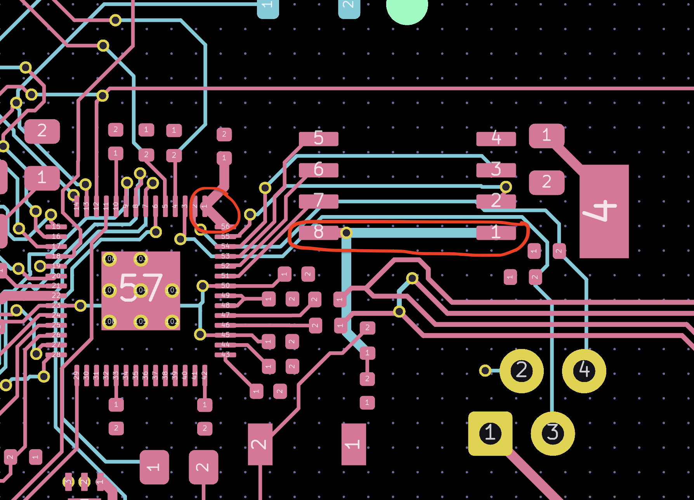
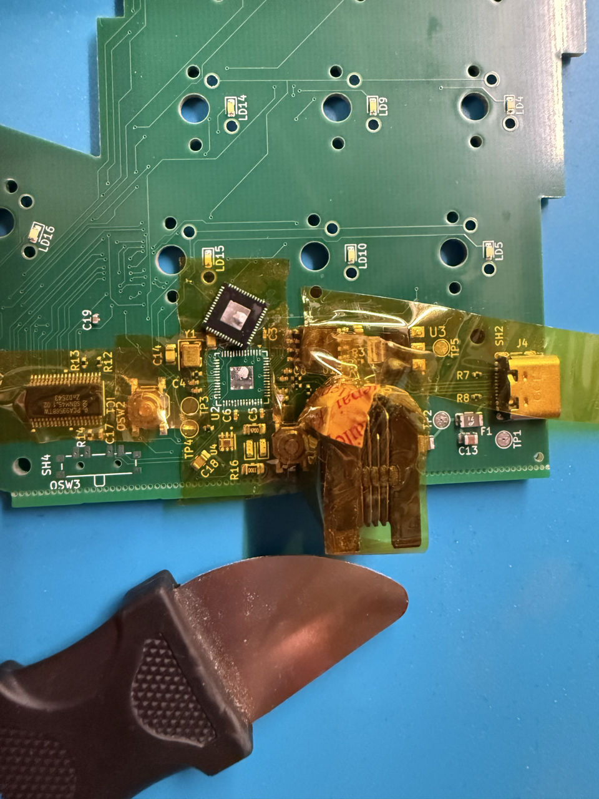
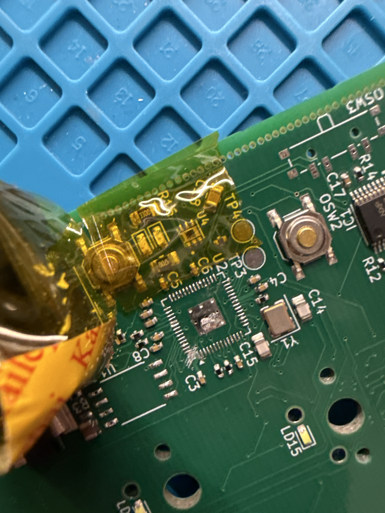

The PCB arrived, and it worked perfectly, except - It didn't. The RP2040 booted up perfectly but as soon as I tried to flash a test firmware, the board (used as a storage device) ejected itself from Finder. 

After some continuity testing with a multimeter, I discovered that I had connected the QSPI CS (chip select) pin of the RP2040 (Pin 56) to the IOVDD pin (Pin 1, a 3,3V input pin powering the RP2040's GPIO pins) and the CS pin (Pin 1) of the WS25Q128 storage chip to the 3,3V net by connecting it to pin 8 of the same chip, which was tied to 3,3V.
This made the storage chip unusable as the chip select pin doesn't ever select or deselect the chip.
KiCad's ratsnet previously led me to believe I had to connect these two (by displaying "+3V3" on them), and while I rembered this quirk when beginning to layout and route the board, a couple weeks later, by the time I ordered the board, I forgot it, and didn't double check with the datasheet one last time.

Due to me not having a hot air station at home, I went to a hackspace in Vienna ([Metalab](https://metalab.at/) in the first district, you should check it out!!) to try and fix the board.

First I desoldered the RP2040:

And broke the connection between pin 56 and pin 1 by scratching it up with a knife: 

I also broke the connection between the storage chip's pin 1 and pin 8 to isolate that pin.

As I've never used a hot air station before, I may have broken the RP2040 and/or W25Q128 storage chip by using too much heat for too long.

I don't have solder paste, flux or a stencil for the RP2040, and I am not confident that I am able to resolder it correctly (RP2040 has a pin pitch of 0.4mm).

While desoldering the storage chip, I unfortunately broke off one of its leads, so I'll have to find a replacement for it.

The best option I know of is reordering the board, which costs 207$. If I manage to resolder the RP2040, I can likely do the repair for a lot cheaper.
I have a second untouched assembled PCB from JLC, and I will try to fix that before reordering.
