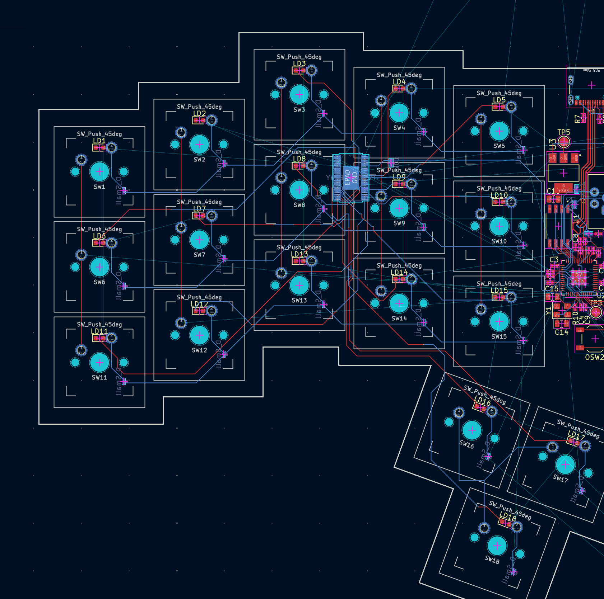
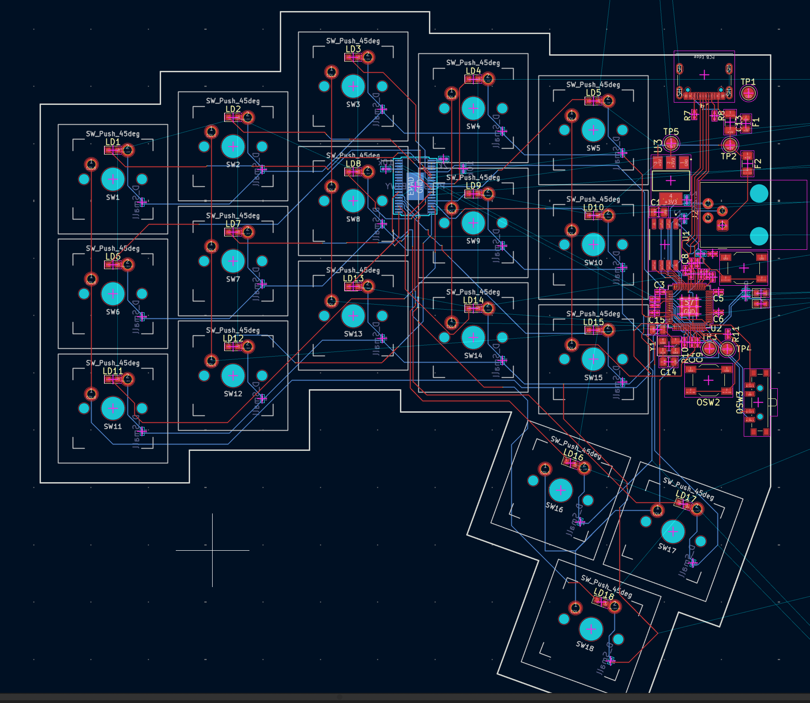

# Split Keyboard with per-key backlighting — Journal (originally exported from Fallout, partially transferred from blueprint to fallout, all journals from blueprint and fallout are included)

## Entry 1: 1 hour

- ID: 16105
- Author: Alex
- Created At: 2025-10-31T22:29:00Z

### Content

My first journal entry for my first hardware project :)

# Rough Scope / Requirements

The first iteration of the keyboard will only be a modification of the one in the guide, as I'm still a beginner at KiCad, electronics and PCB design. These are the main differences between this board and the guide:

- RP2040 instead of nRF microcontroller
- Neopixels or similar LEDs under every key
- Only one chip will be used for both sides (master slave concept)
- Connectivity: Just USB-C, so no battery will be used
- In future iterations: The ability to attach a variety of (magnetic?) modules to the side of the keyboard  with:
  - Rotary encoders (e.g. volume dial)
  - push buttons (e.g. hotswappable additional keys, but also normal buttons)
  - toggle switches (could be used for simracing or flight simmming)
  - etc (to be determined)

# Component selection

- Main (Master) Microcontroller: likely RP2040
- Slave: I2C expander or parallel-in shift register which sends data to Master
- For data transmission between master (left side) and slave (right side): Likely TRRS if the bandwidth is sufficient

# First concept design

## Entry 2: 15 hours

- ID: 16106
- Author: Alex
- Created At: 2026-01-31T14:52:00Z

### Content

Since the last journal, I've spent a bunch of time researching, learning electronics fundamentals and redesigning the basic RP2040 circuit (USB-C, flash, clock) over and over again.

I spent 5 hours researching electronics, component selections, PCB design and routing. Great Scott on youtube does a great (hehe) job of explaining the fundamental components, for higher level (concepts like I2C and SPI), Altium Academy has some great videos. I also read through The RP2040 hardware design guide (<https://pip-assets.raspberrypi.com/categories/814-rp2040/documents/RP-008279-DS-1-hardware-design-with-rp2040.pdf>) and used it as a reference in addition to the RP2040 datasheet.

After getting a grasp on the basics, I started designing the circuit schema in KiCad, starting with the left side of the split. I took the recommended minimal RP2040 circuit from the hardware design guide, then I replaced microUSB with a type C connector (more modern, better compatibility) and messed around with the layout of the traces connecting the MCU to the flash until I found a better layout (the flash reset button wiring in the hardware design guide is very confusing in my opinion). I also landed on splitting off a power rail to the other side of the keyboard (just branching out a trace before the buck converter (ncp1117) and feeding it directly into a TRRS receptacle), after spending about half an hour researching and realizing there is no better solution. In total this also took about 5 hours.

The power-related stuff on the left side of the split:

Then I added status LEDs, the TRRS receptacle to connect the two halves, an ambient light sensor for automatic backlight dimming (TI OPT3001), a rotary encoder as a volume knob, and a button to switch between backlight dimming modes. I used the datasheets of the components as a reference (ctrl+f was my best friend). Initially, I was drawn to using a switch for selecting backlighting modes, however after descending into the madness that are different types of switches and wiring, I decided to opt for the simpler solution of just using a push button. This took about 5 hours in total since I wasn't familiar with the components (especially the light sensor).

GPIO connections on the left side (TRRS not pictured here, but on above screenshot with other power-related components):

Next things to do are: keyboard matrix, backlighting, and figuring out how to avoid shorting the various poles of the TRRS cable together when plugging/unplugging it while powered.

Current screenshot of the entire schematic for the "master" side (left):

## Entry 3: 2 hours

- ID: 16107
- Author: Alex
- Created At: 2026-02-23T22:22:00Z

### Content

I took my time deciding on the layout and format as I plan to daily drive this board in the future and learn a new layout with it (colemak DH). I found an awesome program called QCAD/CAM, with which I tweaked the outline generated by ergogen (a good tutorial on outlines in ergogen: <https://flatfootfox.com/ergogen-part2-outlines/>) to make it more aesthetically pleasing and ergonomic. Overall the visual design is done, however I haven't gotten around to finishing the cicuit design yet.

The finished outline with keys shown:

Intial outline from ergogen:

## Entry 4: 8 hours

- ID: 16108
- Author: Alex
- Created At: 2026-06-02T02:41:00Z

### Content

I decided to replace the TRRS connector between the two halves with RJ45 to mitigate the issue of shorting together some connections when (un)plugging TRRS while its powered.

Then I made the schematic of the 3x6 key matrix. On keyboard specific KiCAD stuff, I watched some tutorials by Joe Scotto (I think his videos are recommended in the macropad guide too).

I also replaced some default symbols with proper ones ([snapmagic](https://www.snapeda.com/) is a good website for finding symbols, footprints and 3d models) and added a push button to the RUN pin to make it functional. I added the LED driver and LEDs (not in a matrix, the LED driver has 24 pins!) to the schematic, and compartmentalized the schematic to make it more readable.

Everything up to here took about 3 hours.

Current master (left) side schematic:

Because the two halves of my split are not mirrored versions of eachother, I created a new hierarchical sheet for the right side. I learned that KiCad connects identically named nets on different sheets together, which led to having to create custom nets for GND (R_GND), +3V3 (+3V3_R) and +5V (+5V_R) and making sure not to use the defaults, which was pretty annoying. After I had that set up, I added the otehr side of the RJ45 connector, also with an NCP1117 stepdown to 3,3v.

Then I added the IO expander and copied the keyboard matrix over from the master side.

Same with the LED driver:

And the ambient light sensor:

I decided to route all data between the two sides over I2C, so I could use an RJ45 connector with 4P4C (4 connections in the cable), one for ground, one for I2C data, one for I2C clock, and one for 5V power. 

Creating the second side of the PCB schematic took 5 hours.
Complete right side of the schematic:

## Entry 5: 3 hours

- ID: 16109
- Author: Alex
- Created At: 2026-06-02T02:59:00Z

### Content

Got the kbplacer plugin set up in KiCad and imported and converted the ergogen exported files to use them with it. Messed up here multiple times, so this was probably the most frustrating part. I know using autoplacing is a grey area in whats allowed, however placing 36 keys exactly at these spacings and weird angles is impossible manually. Imported the DXF file which I modified from the exported ergogen outline into KiCad and tried to align it perfectly with where kbplacer is placing the keys (still working on that!).

I noticed that the topmost line of the outline of the keyboard was angled slightly, which messed up all of my exact placings, so I'll have to redo that in QCADCAM (that software is awesome btw).

Also KiCad does not like the imported DXF, as the outline does not get displayed correctly in the 3D editor (and there are 400+ DRC errors lol). kbplacer is giving me a bunch of errors too (but it works lol), so there's a lot left to clean up (yes I know the component placements are terrible, I'll move them once I have the outline and kbplacer stuff figured out)!

## Entry 6: 1 hour

- ID: 16110
- Author: Alex
- Created At: 2026-06-02T20:54:00Z

### Content

I noticed that the space I allocated for all the components on the layout was way too small, so I went back into CAD and modified the outline to give the components more space. Then I started re-layouting the components, starting from the USB-C port.

---Journals from this point on are from fallout---

## Entry 7: 2 hours 9 minutes (lapse)

- ID: 11626
- Author: Alex
- Created At: 2026-06-04T15:23:08Z

### Content

I redid the USB traces & got confused while routing the RP2040 and its decoupling caps.

I also had to do some research (reddit (r/KiCad), raspi forums, official hardware design guide are the main resources I used), I had to look up a lot of things as I went, as this is my first hardware project.

Lots of TODOs:

- Fix 0402 imperial and metric confusion
- Fix DRC errors (are holes of claws of USB-C and ethernet receptacles big enough to manufacture at JLC?)
- Proper decoupling cap distribution between pins
- Manage the +1.1V and +3.3V situation (maybe create +1.1V net)
- Likely more stuff I forgot

Screenshot of the PCB region I worked on here:

### Recording Links

- <https://lookout.hackclub.com/api/media/cda9790b-99ee-49d6-a44a-27ab50fa6f65/video.mp4>

## Entry 8: 1 hour 11 minutes (lapse)

- ID: 11695
- Author: Alex
- Created At: 2026-06-04T19:55:05Z

### Content

I tried to understand the decoupling capacitor placement for the RP2040 and realized I did the cap layout all wrong. In the process a made a lil table of all the power pins and a little sketch to illustrate their physical locations on the footprint, and what kind of caps they are supposed have. Please excuse by subpar handwriting skills. (The screen was on the same view for a long time at the end because I was writing this by hand).

### Recording Links

- <https://lookout.hackclub.com/api/media/045bb16c-87d7-4f40-a2ca-23ea957c171d/video.mp4>

## Entry 9: 24 minutes (lapse)

- ID: 11730
- Author: Alex
- Created At: 2026-06-04T21:59:53Z

### Content

I now think I know how to route the decoupling caps of the RP2040 cleanly and the "right way". This is only part 1, I'll be finishing it tomorrow.

### Recording Links

- <https://lookout.hackclub.com/api/media/48901000-90c8-45db-88f3-d2075e02c8be/video.mp4>

## Entry 10: 1 hour 5 minutes (lapse)

- ID: 11810
- Author: Alex
- Created At: 2026-06-05T10:21:52Z

### Content

Today I finished routing the decoupling caps, routed the crystal oscillator and two status LEDs.

I also figured out that I can’t route with this trace width and how to change it. Now I just need to make it apply retroactively to all other traces and redo some routing, because this thinner trace width is much easier to deal with. I already had the constraints setup correctly in the 'constraints' tab, but KiCad still used the minima from the 'Default' netclass, so I had to update those.

Part of the PCB I worked on today:

### Recording Links

- <https://lookout.hackclub.com/api/media/1e5dcf67-8fbf-4721-ad80-1dc5848d90b4/video.mp4>

## Entry 11: 1 hour 15 minutes (lapse)

- ID: 11827
- Author: Alex
- Created At: 2026-06-05T12:36:54Z

### Content

Routed flash storage, timer crystal, reset buttons and test pads. Also I improved the general layout around the RP2040, even though it is still quite messy. Corrected a few mistakes I made before like the default trace width being very wide.

Due to the keyboard switches and their LEDs being laid out by kbplacer from top to bottom, but in the schematic numbered by side (left: 1-18, right: 19-36), there are some mismatches: Many LEDs from the left side want to connect to the LED driver on the right and vice versa, and many switches also connect to the wrong side.

Portion of the PCB i worked on:

### Recording Links

- <https://lookout.hackclub.com/api/media/234d2431-5c4f-45ff-9534-860b33ae7efb/video.mp4>

## Entry 12: 21 minutes (lapse)

- ID: 12135
- Author: Alex
- Created At: 2026-06-06T21:16:25Z

### Content

Renamed all the key switches and diodes (those only on the right side) to fix where the kbplacer auto placement messed up. Also fixed some col/row assignments, because kbplacer also messed up there. The cleanup seems to take more work than if I had just positioned all the switches manually, but hey, I need that exact placement.

Part of the PCB I worked on (the entire thing):

### Recording Links

- <https://lookout.hackclub.com/api/media/10a55efe-bd82-4567-8f5d-98837fecc5bf/video.mp4>

## Entry 13: 15 minutes (lapse) + 40 minutes lost by lapse due to going through some tunnels in a train

- ID: 12445
- Author: Alex
- Created At: 2026-06-08T08:00:03Z

### Content

Renaming footprints and pads, fixing nets, fixing silkscreen.

About 40 minutes got lost due to no internet connection, I hope I can get those refunded :( (both the time elapsed in the status bar and in the lookout window were increasing, decreasing and freezing a lot, so unfortunately none of them is reliable).

### Recording Links

- <https://lookout.hackclub.com/api/media/84248ee9-f5a4-41b3-87ac-e47bc816097e/video.mp4>

---Journals from this point on are NOT from fallout---

## Entry 14: 2 hours, 30.06.2026
Routed all the LEDs to the LED driver on the right side and routed the rest of all unconnected things on the switches, doides ad LEDs on the right half, except the Row/col wiring for the thumb cluster (TODO).

## Entry 15: 2 hours, 01.07.2026
Routed the thumb cluster, so the entire right hand matrix + LEDs is now finished. Rerouted a lot of the previous days' work to make it cleaner. TODO: Figure out power plane 3.3 and 5V separation and pours.

RUNNING TOTAL: 41h 20m (including the 40min lost by lapse)
