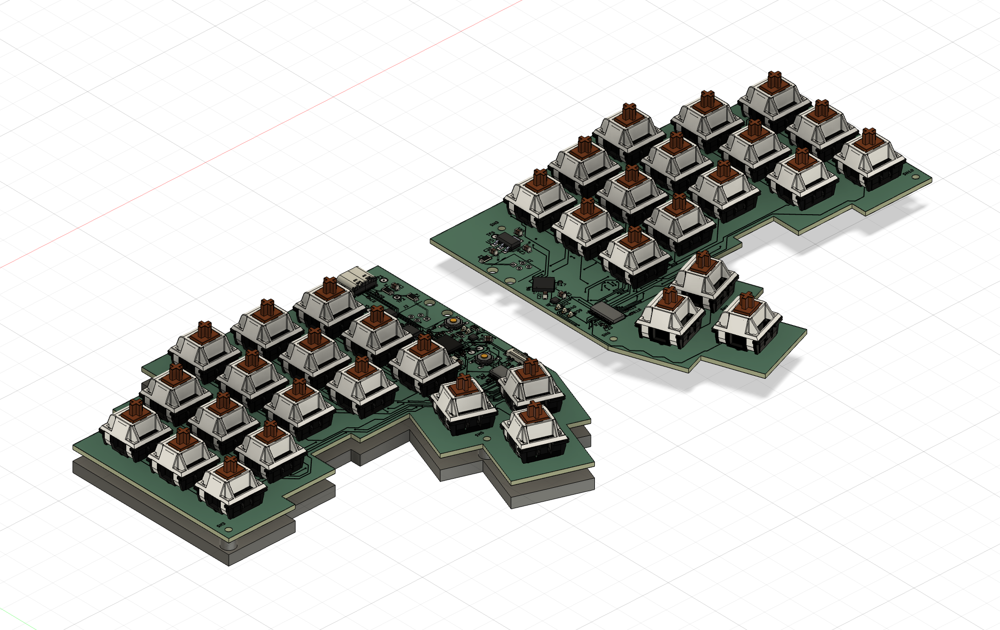
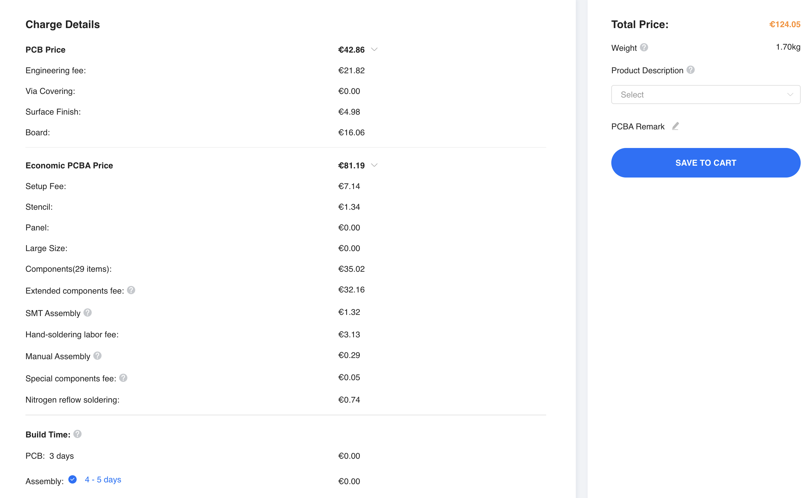
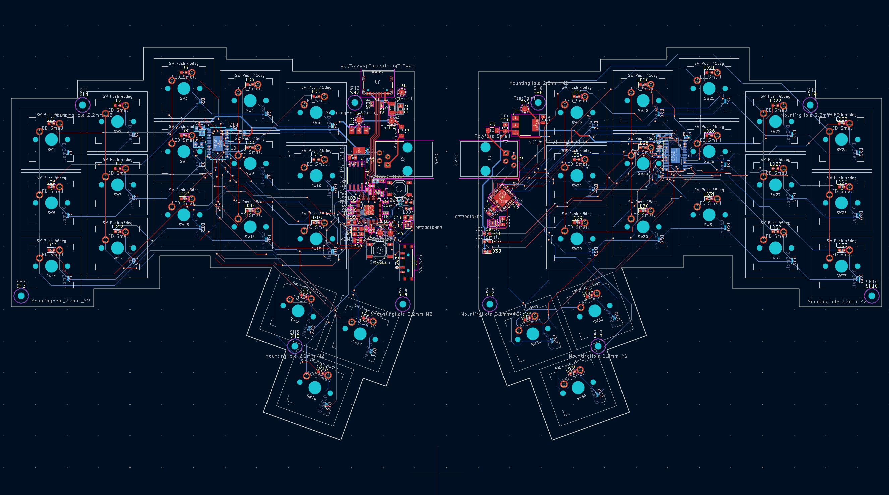
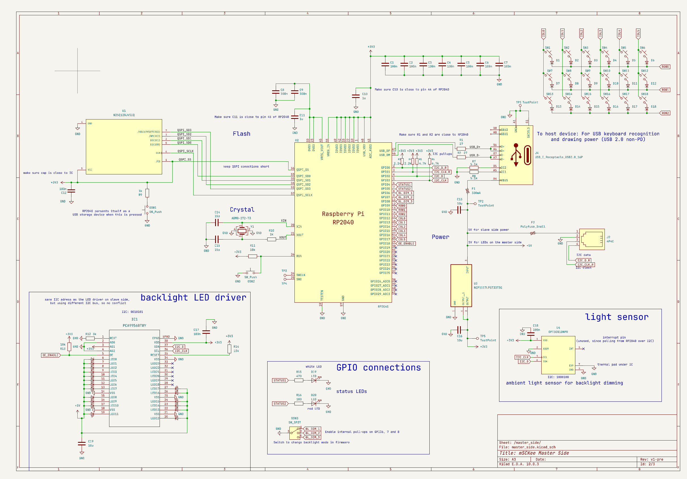
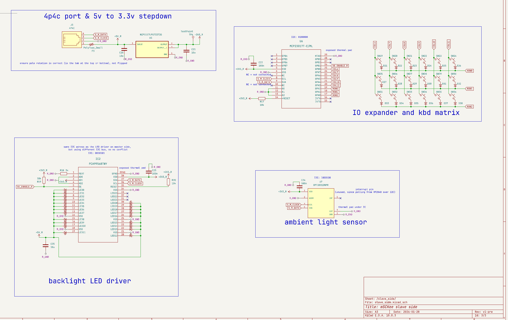

# mSCKee

Split Keyboard with per-key white backlighting, adapting to ambient brightness.

## Highlights
- dimmable white backlighting for every key, programmable to display animations
- two light sensors (one per side) to automatically dim backlight
- Dedicated RP2040 MCU IC
- Minimalist aluminium enclosure
- USB-C 2.0 connectivity
- 4 layer board: Signal - GND - 3,3V and 5V split pour - Signal
- RJ9 cable connection between halves
- Cherry MX 5 pin switch compatible

## BOM

The JLC BOM covers the majority of expenses:

Total cost of JLCPCB(A):

| Description                            | Price                     | Justification                                                                                  |
|----------------------------------------|---------------------------|------------------------------------------------------------------------------------------------|
| JLCPCB manutfacturing and PCB assembly | 124.05€ + 22.72€ shipping |                                                                                                |
| Cherry MX Red Switch kit               | 17.99€ + 11.99€ shipping  | https://shop.cherry.de/cherry-mx2a-rgb-red-switch-kit.html                                     |
| SP3T Switch: PCM13SMTR                 | 1.17€                     | No equivalent available at JLC https://www.digikey.at/en/products/detail/c-k/PCM13SMTR/1640113 |
| JLCCNC                                 | ~20€ + shipping           | Future expense for aluminium enclosure                 | Total                                        | 197,92€ ||
| Total (USD)| ~226.26USD ||

## PCB routing & schematic

