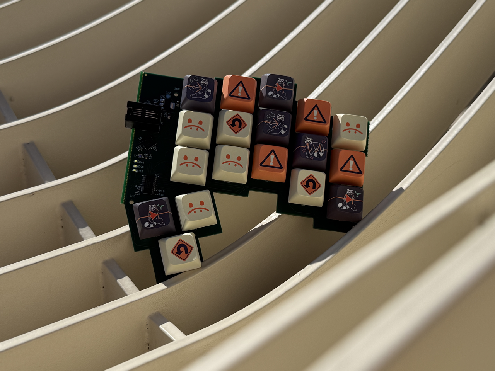
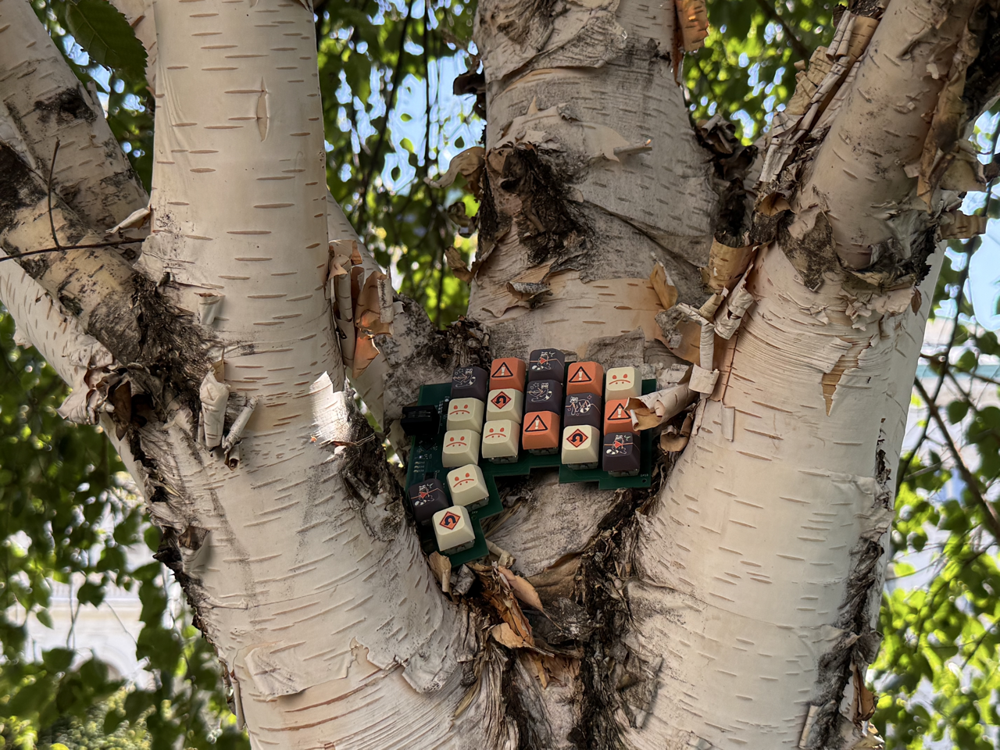
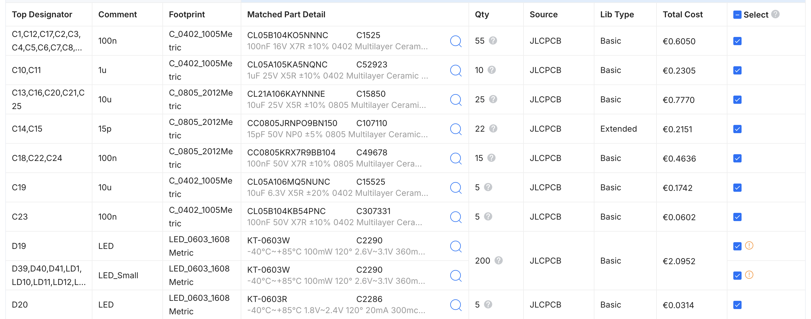
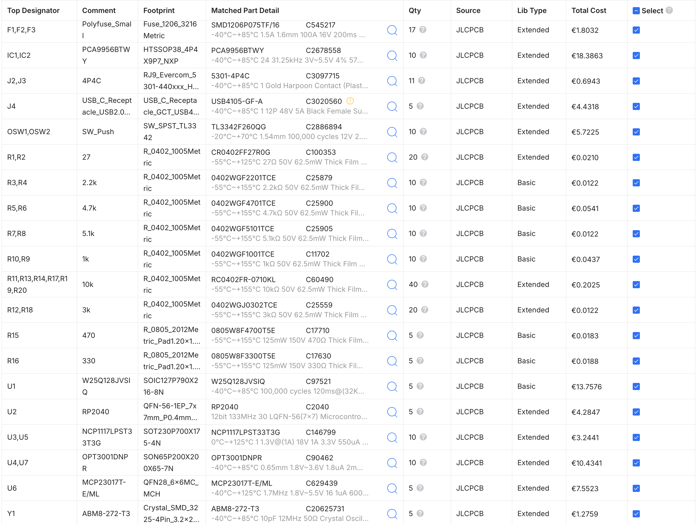
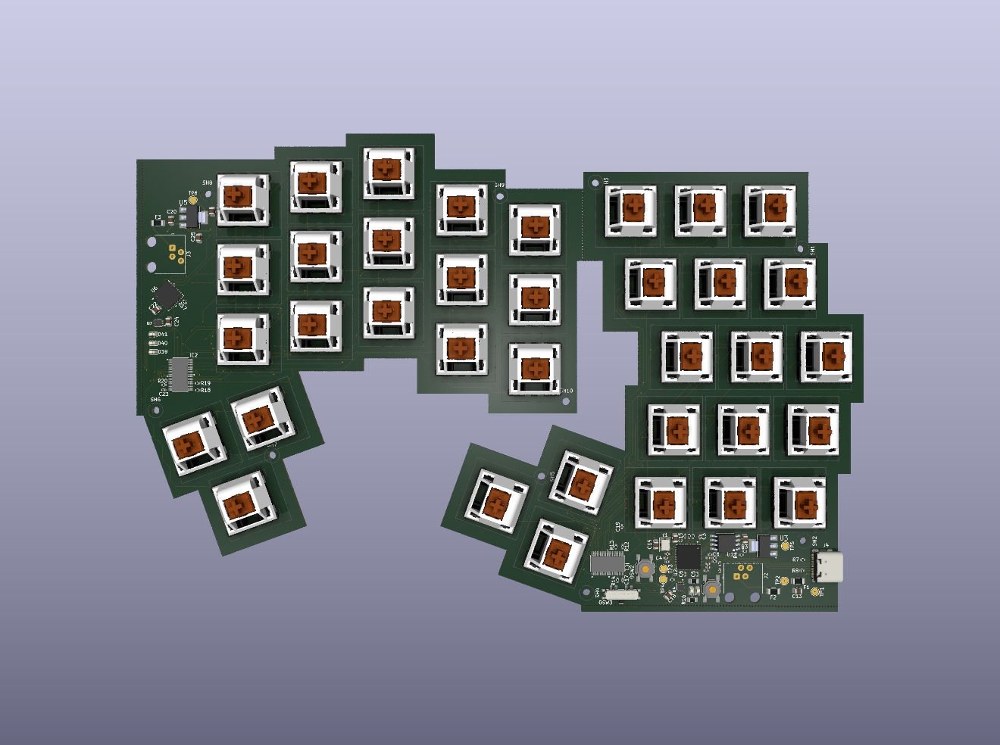

# mSCKee

| | |
|-|-|

__msCKee__ is an open source split Keyboard with per-key white backlighting, and two light sensors, adapting to ambient brightness.

It features:
- dimmable white backlighting for every key, programmable to display animations
- two light sensors (one per side) to automatically dim backlight
- Integrated RP2040 MCU IC
- Minimalist aluminium enclosure
- USB-C 2.0 connectivity
- 4 layer board: Signal - GND - 3,3V and 5V split pour - Signal
- RJ9 cable connection between halves
- Cherry MX 5 pin switch compatible

All manufacturing and part costs were covered by Hack Club through their Outpost program (<https://outpost.hackclub.com>), which I am very grateful for.

Keycaps are custom from Hack Club for Outpost, product photos (top of the README) were taken in Vienna, Austria.

## BOM

The JLC BOM covers the majority of expenses:

Total cost of JLCPCB(A):

| Description | Price/Piece | Total Price | Purchase link | Justification |
|---|---|---|---|---|
| JLCPCB manufacturing and PCB assembly | 124.05€ + 22.72€ shipping | 146.77€ | | |
| Cherry MX Red Switch kit | 17.99€ + 11.99€ shipping | 29.98€ | https://shop.cherry.de/cherry-mx2a-rgb-red-switch-kit.html | |
| SP3T Switch: PCM13SMTR | 0.82€ | 5×0.82€ + 5.90€ shipping + 20% VAT = 12€ | https://www.tme.eu/at/details/pcm13smtr/schiebeschalter/c-k/ | No equivalent SP3T switch is available at JLC |
| 1N4148W7F DII SOD-123 diode | 0.05€ | 36×0.05€ + 6.95€ shipping + 20% VAT = 10.5€ | https://www.reichelt.com/at/en/shop/product/small-signal_switching_diode_100_v_300_ma_sod-123-219381 | Diodes for key matrix, mounted on back side of PCB, so not assembled or provided by JLC |
| **Total** | | **199.25€** | | |
| **Total (USD)** | | **232.59USD** | | |

## PCB & schematic images

